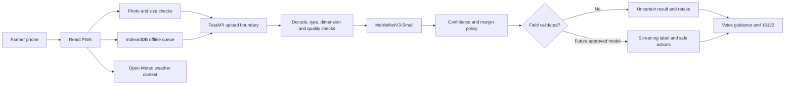

# AluSathi FieldWatch — Technical Documentation

## Purpose

AluSathi is a Bangla-first potato-leaf screening prototype for Bangladesh farmers. It helps a farmer photograph one leaf or follow a five-location field check, hear simple guidance, retain a private on-device diary, and recover from poor connectivity.

It is a screening and research system, not a confirmed diagnosis or pesticide-prescription system.

## Current runtime architecture



## Active components

| Layer | Implementation | Responsibility |
| --- | --- | --- |
| Interface | React 18, TypeScript, Vite | Bangla/English farmer journey |
| PWA | `vite-plugin-pwa` | Installable shell and weather caching |
| Offline scans | Browser IndexedDB | Stores pending images only on the farmer's device |
| Weather | Open-Meteo | Current temperature, humidity and precipitation context |
| API | FastAPI | Secure upload validation, inference and safe response contract |
| Vision model | MobileNetV3-Small, PyTorch | Three-class potato-leaf research classifier |
| Safety policy | Server-side Python | Quality, confidence, margin and field-validation rejection |

The active application route is `/`. Legacy source files may remain in the repository, but they are not mounted by `src/App.tsx` and are outside the competition demo path.

## Farmer flow

1. Choose one-leaf or five-location mode.
2. Photograph one potato leaf in daylight from close range.
3. The server verifies the file before inference.
4. AluSathi either returns a safe screening response or asks for another photo.
5. The farmer can hear the instructions, retake the photo or call Agriculture Call Centre 16123.
6. When offline, the photo remains in IndexedDB and is checked after reconnection.

## Model state

- Training source: PlantVillage potato subset.
- Classes: early blight, healthy and late blight.
- Controlled test accuracy: 95.98% on 323 PlantVillage images.
- External regional accuracy: 51.19% on 13,800 unseen regional images.
- Field status: not approved.
- Default API behavior: fail closed to `unknown` until an approved replacement model is explicitly enabled.

See `MODEL_CARD.md`, `DATASET_CARD.md` and `PHASE1_EVALUATION.md` for evidence.

## Local operation

```powershell
npm install
npm run api
```

In another terminal:

```powershell
npm run dev
```

Open `http://127.0.0.1:8080/`.

## Verification

```powershell
.venv\Scripts\python.exe -m unittest tests.test_inference_policy tests.test_api_safety
npm run lint
npm run build
npm audit --omit=dev
```

## Deployment status

Public deployment is deliberately deferred. The repository and local demo are ready; production hosting, HTTPS, environment configuration and operational monitoring belong to the skipped deployment phase.
